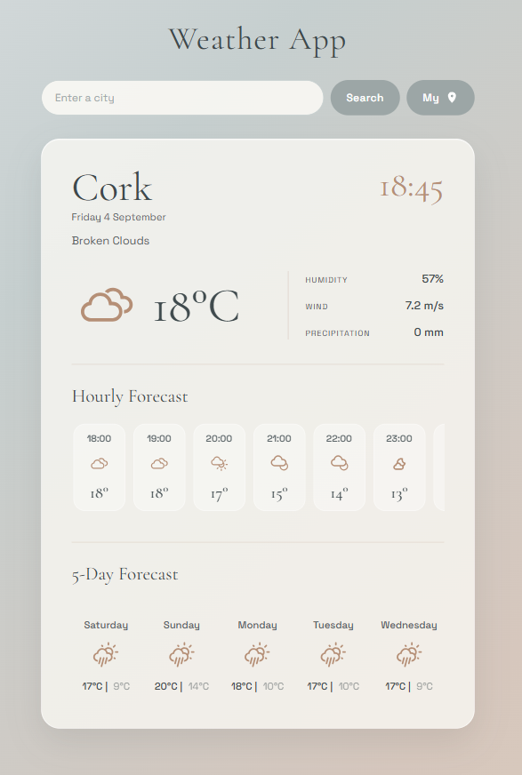

# 🌤️ Weather App (React + OpenWeather)

<<<<<<< HEAD


=======

>>>>>>> 9ef5a475a26515018948ac72597bc936f698abb3

A responsive weather application built with **React and Vite**, using the **OpenWeather API** to display current weather conditions, hourly forecasts and a 5-day forecast for cities around the world.

🔗 **Live Demo:** https://react-weather-app-pamortega.netlify.app/

💻 **GitHub:** https://github.com/Pampinup/weather-react-vite/

---

## ✨ Features

- 🔎 Search weather by city
- 📍 Use the user's current location
- 🌡️ Current temperature in Celsius or Fahrenheit
- 💧 Humidity information
- 💨 Wind speed
- 🌧️ Current precipitation
- 🕐 Local date and time for each city
- 🌤️ Dynamic weather icons based on weather conditions
- ⏰ Hourly weather forecast
- 📅 5-day weather forecast
- 📱 Fully responsive design for desktop, tablet and mobile
- ⏳ Loading indicator while fetching data
- ⚠️ Error handling for invalid cities and location errors
- 🔐 API key protected from being committed to the repository using environment variables

---

## 🛠️ Technologies

- **React**
- **Vite**
- **JavaScript (ES6+)**
- **HTML5**
- **CSS3**
- **Axios**
- **OpenWeather API**
- **Font Awesome**
- **React Loader Spinner**
- **Git & GitHub**
- **Netlify**

---

## 📡 API

Weather data is provided by the **OpenWeather API**, using the **One Call API 4.0** for hourly and daily forecasts.

The application retrieves:

- Current weather data
- Hourly forecast data
- Daily forecast data
- Weather conditions and icons
- Local timezone information

---

## 🔐 Environment Variables

The API key is stored locally in an environment variable rather than directly in the source code.

Create a `.env` file in the project root:

```env
VITE_OPENWEATHER_API_KEY=your_api_key_here
```

The `.env` file is included in `.gitignore` and is **not committed to GitHub**.

> For production applications, API keys exposed in client-side applications should not be considered fully secret. A backend or serverless proxy would be required for true API key protection.

---

## 🚀 Installation

Clone the repository:

```bash
git clone https://github.com/Pampinup/weather-react-vite.git
```

Navigate to the project folder:

```bash
cd weather-react-vite
```

Install dependencies:

```bash
npm install
```

Create your `.env` file and add your OpenWeather API key:

```env
VITE_OPENWEATHER_API_KEY=your_api_key_here
```

Start the development server:

```bash
npm run dev
```

The application will then be available through the Vite development server.

---

## 📱 Responsive Design

The application was designed and tested across different screen sizes:

- 🖥️ Desktop
- 📱 Mobile
- 📲 Tablet

The layout adapts using **CSS Grid, Flexbox and responsive media queries**, without relying on a CSS framework.

---

## 💡 What I Learned

This project was an important step in my journey from JavaScript to React.

Through the development of this application, I practised:

- Building reusable React components
- Managing state with `useState`
- Working with side effects using `useEffect`
- Passing data between components using props
- Making API requests with Axios
- Handling asynchronous data
- Working with external APIs
- Converting temperatures between Celsius and Fahrenheit
- Working with timezones and local dates
- Creating responsive layouts with CSS
- Handling loading and error states
- Using environment variables with Vite
- Deploying a React application with Netlify
- Managing a project with Git and GitHub

One of the most valuable parts of the project was learning how to think about **data, components and UI as separate but connected parts of an application**.

---

## 🎨 Design

The interface was designed with a minimalist and elegant aesthetic, using a soft colour palette, typography contrast and a glass-inspired weather card.

The layout focuses on keeping the weather information clear and easy to scan while maintaining a responsive experience across devices.

---

## 👩‍💻 Author

**Pam Ortega**

Frontend Developer in progress | React & JavaScript

- 🌐 Portfolio: https://desing-main-portfolio.netlify.app/
- 💻 GitHub: https://github.com/Pampinup/

---

## 📄 License

This project was created for educational and portfolio purposes.
